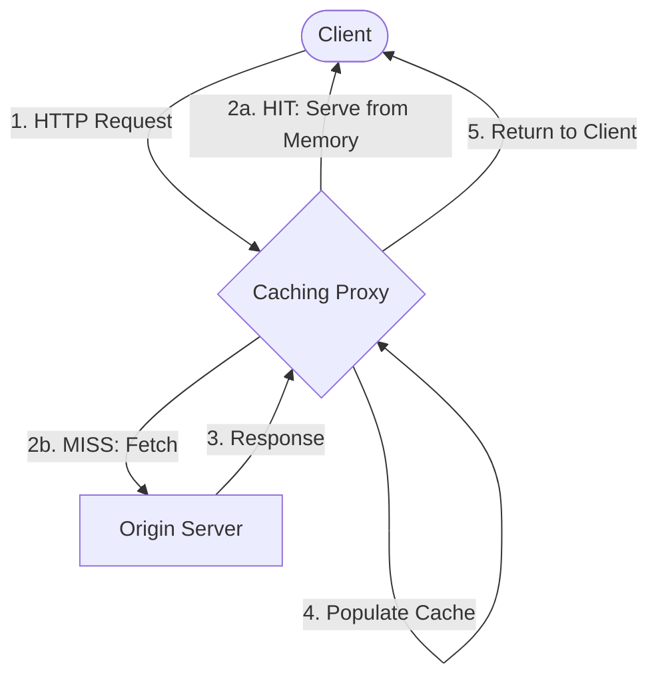

# Caching Proxy

A high-performance, minimalist CLI caching proxy server written in Go using Fiber v3. It intercepts HTTP requests, forwards them to a target origin server, and caches responses. Subsequence requests are served instantly from memory, bypassing the origin.

---

## Features

- **Blazing Fast**: Powered by Go and Fiber v3.
- **Zero-Downtime Cache Clearing**: Purges active server cache on the fly without stopping the daemon.
- **X-Cache Headers**: Automatically tracks cache status (`X-Cache: HIT` / `X-Cache: MISS`).
- **Flexible CLI**: Full support for both verbose (`--port`, `--origin`) and shorthand (`-p`, `-o`, `-c`) flags.

---

## Architecture



---

## Installation & Run

### 1. Build the Binary
```bash
go build -o caching-proxy
```

### 2. Start the Proxy Server
Provide the server port and the destination origin server URL:
```bash
./caching-proxy --port <port> --origin <origin_url>
```

#### Example:
```bash
./caching-proxy -p 3000 -o http://dummyjson.com
```
Now, any request sent to `http://localhost:3000/products` will be proxied to `http://dummyjson.com/products` and cached.

---

## Cache Headers

Every response returned by the proxy includes the `X-Cache` header:

- `X-Cache: MISS` — Request forwarded to the origin server (responses are cached).
- `X-Cache: HIT` — Response served directly from the local in-memory store.

---

## Clearing the Cache

To clear the cache of an active, running proxy server instance without restarting it, run the command with the clear flag (optionally specifying the port of the running instance if it's not the default `8080`):

```bash
./caching-proxy --clear-cache
# or shorthand
./caching-proxy -c -p 3000
```

*Note: This fires an internal `DELETE /clear-cache` request to the running server to flush its in-memory storage safely.*
