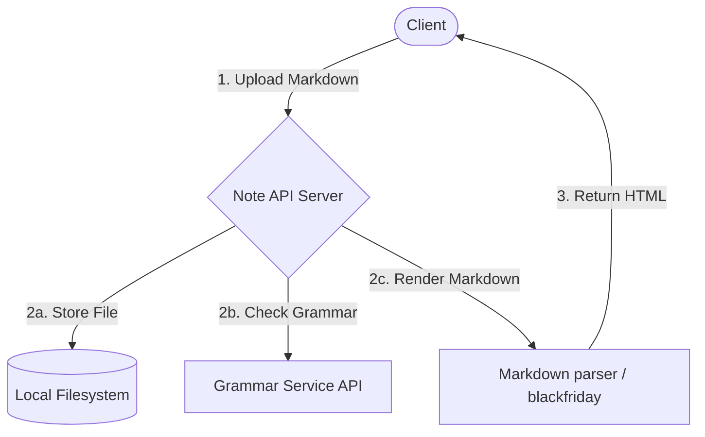

# Markdown Note-taking App

A minimalist, high-performance RESTful API written in Go that allows users to upload, manage, check the grammar of, and render Markdown notes to HTML.

---

## Features

- **Markdown Storage**: Save raw markdown notes securely to the local filesystem.
- **HTML Renderer**: Instantly parse and convert Markdown notes into clean, semantic HTML.
- **Grammar Checker**: Analyze note content and retrieve real-time grammar corrections.
- **Metadata Listing**: List all uploaded markdown notes with their system details.

---

## Architecture & Data Flow



---

## API Endpoints

| Endpoint | Method | Description | Request Body | Response |
| :--- | :--- | :--- | :--- | :--- |
| `/api/notes` | `POST` | Save a new note (as markdown) | `{"title": "string", "content": "string"}` | `201 Created` |
| `/api/notes` | `GET` | List all saved markdown notes | *None* | `200 OK (JSON array)` |
| `/api/notes/:id/render` | `GET` | Fetch rendered HTML version | *None* | `200 OK (HTML/Text)` |
| `/api/notes/grammar` | `POST` | Check grammar of markdown text | `{"content": "string"}` | `200 OK (Grammar Report)` |

---

## Getting Started

### 1. Prerequisites
- Go 1.20+ installed.

### 2. Installation
Clone this repository and download dependencies:
```bash
go mod tidy
```

### 3. Run the Server
Start the development server:
```bash
go run main.go
```
The server will start listening on `http://localhost:8080`.

---

## Example Usage

### Save a Note
```bash
curl -X POST http://localhost:8080/api/notes \
  -H "Content-Type: application/json" \
  -d '{"title": "getting-started", "content": "# Hello World\nThis is an *awesome* note-taking app written in Go!"}'
```

### Get Rendered HTML
```bash
curl http://localhost:8080/api/notes/getting-started/render
```
**Response:**
```html
<h1>Hello World</h1>
<p>This is an <em>awesome</em> note-taking app written in Go!</p>
```
